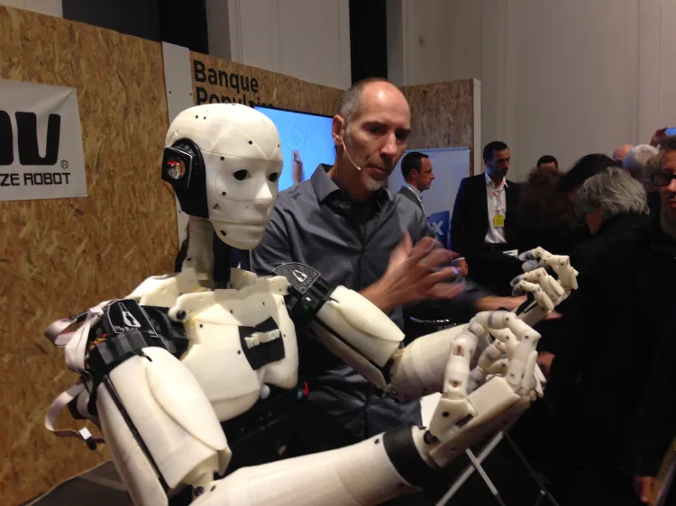

# Inmoov_ROS2

*v1.0.0 — First stable ROS2 version of the Paul InMoov robot. June 2025
The previous non-ROS implementation (MyRobotLab) is available in the repository*:
https://github.com/aalonsopuig/Paul_Robot

Welcome to the **InMoov ROS2 Project**. This project builds upon the open-source InMoov humanoid robot platform, originally designed by [Gaël Langevin](https://inmoov.fr/), integrating it with ROS 2 (specifically the Jazzy Jalisco distribution) to create a modular, autonomous system capable of vision, speech, and interactive behaviors.

  

The project is fully open-source and, as of today, the system is completely functional, demonstrating effective real-time face detection and recognition, natural speech synthesis, and coordinated robot control.

The development and maintenance of this project are led by Alejandro Alonso Puig, aimed at providing a scalable and maker-friendly robotic platform accessible to the wider robotics and AI community.

## Project Overview

The InMoov ROS2 project focuses on creating a flexible, scalable, and maker-friendly robotic system capable of interacting with people through vision and speech. The system architecture is based on a distributed model, combining a central processing unit running ROS 2 with microcontroller subsystems that control the robot’s articulations.

Demo video:

Key features include:

- Modular hardware and software architecture  
- Real-time face detection and recognition  
- Natural speech synthesis with synchronized mouth movement  
- Reactive and personalized interaction behaviors  

## Goals

The primary goals of the project are to:

- Provide an open and extensible humanoid robotic platform accessible to the maker community  
- Demonstrate effective integration of ROS 2 with embedded microcontrollers and AI components  
- Develop robust computer vision capabilities for face detection and recognition  
- Implement high-quality, offline text-to-speech synthesis  
- Enable interactive behaviors based on user recognition and environmental input  

## Documentation

This section contains the technical documentation for the **Paul InMoov ROS2** project.  
Each page describes a different aspect of the system architecture, software components, and usage.

1. [Architecture Overview](docs/architecture-overview.md): High-level description of the hardware and software architecture of the robot system.
2. [ROS2 Packages and Nodes](docs/ros2-packages-and-nodes.md): Overview of the ROS2 packages included in the project and the main nodes implemented.
3. [Arduino Subsystems](docs/arduino-subsystems.md): Description of the Arduino-based servo control subsystems and their integration with ROS2.
4. [Repository Structure](docs/repository-structure.md): Explanation of the repository organization and the purpose of each directory.
5. [Installation](docs/installation.md): Step-by-step guide to install dependencies and set up the development environment.
6. [Usage](docs/usage.md): Instructions for running the system and launching the main components.
7. [License and Credits](docs/license-and-credits.md): Licensing information and acknowledgements for the project and its contributors.

## License

This project is licensed under the [Apache License 2.0](LICENSE).
