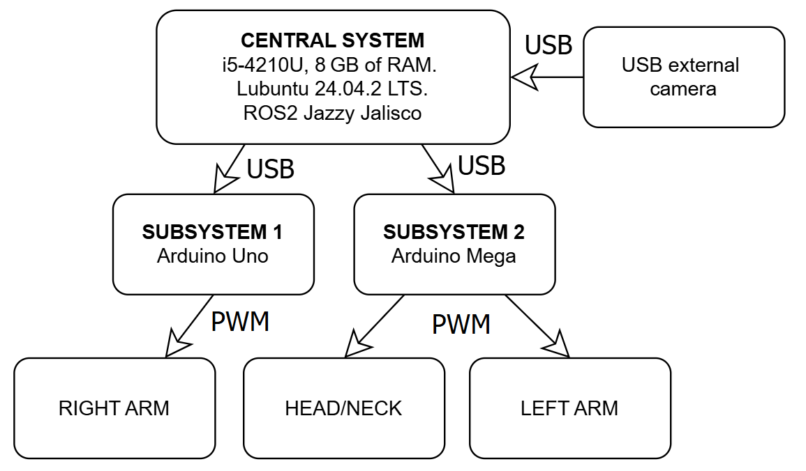
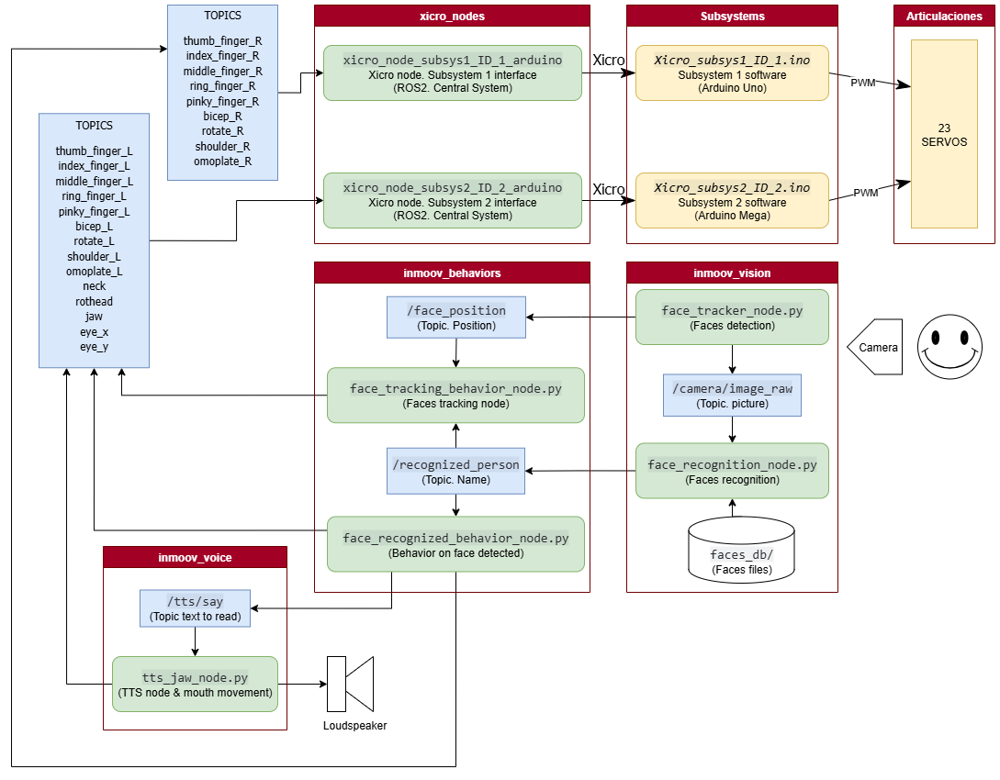

 
 

This section provides a high-level description of the hardware and software architecture of the InMoov ROS2 project. It explains how the different components interact to form a modular, distributed robotic system.

## Hardware Architecture

The InMoov robot system is designed as a distributed hardware architecture consisting of a central processing unit and multiple microcontroller-based subsystems:

  

- **Main System:**  
  A computer running Ubuntu 24.04 LTS with ROS 2 Jazzy Jalisco installed. This unit is responsible for high-level processing tasks such as vision, speech synthesis, behavior control, and overall system coordination.

- **Microcontroller Subsystems:**  
  Two Arduino boards serve as microcontroller subsystems managing the real-time control of servomotors and sensors:  
  - **Arduino Uno:** Controls the right arm servos.  
  - **Arduino Mega:** Controls the left arm servos and head movements, including jaw and eyes.

- **Servomotors and Actuators:**  
  Various hobby servos with specific torque ratings are used to actuate the robot's joints and facial features. The servos are powered by a dedicated 6V / 5A switched-mode power supply to ensure stable and sufficient current.

- **Vision System:**  
  A USB webcam mounted on the robot’s head provides live visual input for face detection and recognition tasks.

This distributed hardware design facilitates modularity and scalability, allowing individual subsystems to be upgraded or replaced independently without affecting the entire system.

## Software Architecture

The software system is built around ROS 2 (Robot Operating System, version Jazzy Jalisco), a modular middleware framework that provides communication infrastructure and tools for robotic applications. Key elements include:

  

- **ROS 2 Nodes and Packages:**  
  The system is decomposed into multiple packages and nodes, each responsible for a specific functional domain:

  - **xicro_nodes:**  
    Handles serial communication between ROS 2 and the Arduino subsystems. This package manages the exchange of servo position commands and status updates.

  - **inmoov_vision:**  
    Implements computer vision functionalities including face detection and recognition. Utilizes OpenCV for Haar cascade detection and Dlib for embedding-based recognition.

  - **inmoov_voice:**  
    Provides text-to-speech (TTS) capabilities using the offline neural network-based Piper engine. Also synchronizes mandibular servo movements with synthesized speech.

  - **inmoov_behaviors:**  
    Manages the robot’s reactive behaviors and scripted sequences, coordinating motion commands and voice outputs based on sensory input.

- **Communication via Topics:**  
  ROS 2 topics serve as the main communication channels, enabling decoupled and asynchronous message passing between nodes. For example, vision nodes publish recognized face IDs to topics subscribed by behavior nodes, which in turn publish servo commands to xicro nodes.

- **Launch Files and Configuration:**  
  The system is initialized through ROS 2 launch files that orchestrate the startup of multiple nodes with appropriate parameters, ensuring modular deployment and easy reconfiguration.

This software architecture leverages ROS 2’s strengths in modularity, scalability, and real-time communication, enabling flexible integration of AI components such as neural-network-based vision and speech modules within a maker-friendly robotics platform.

