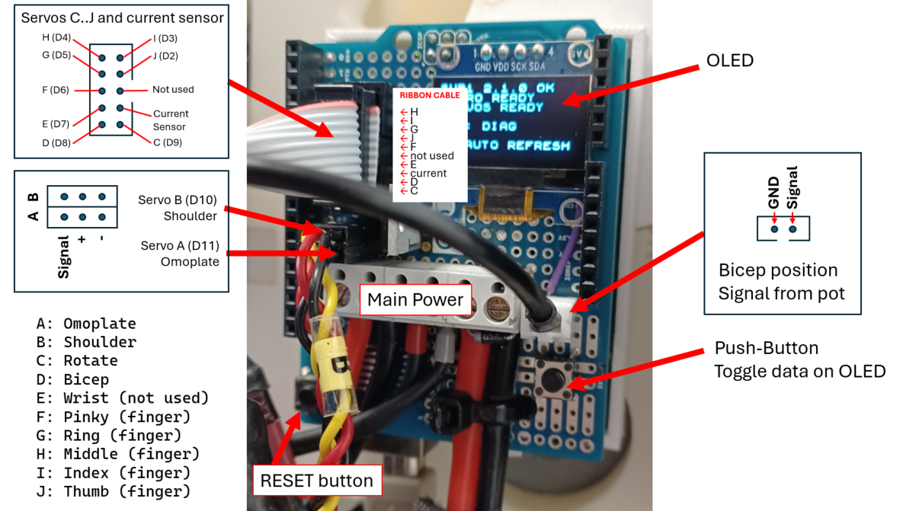
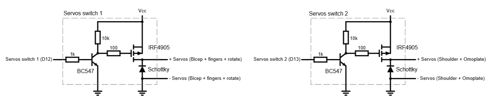
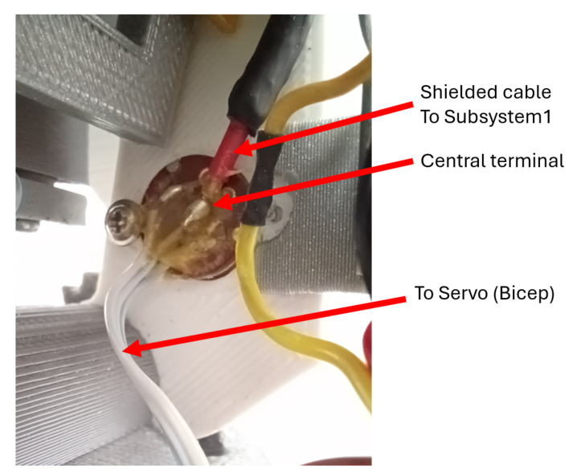
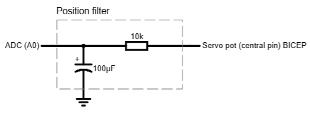
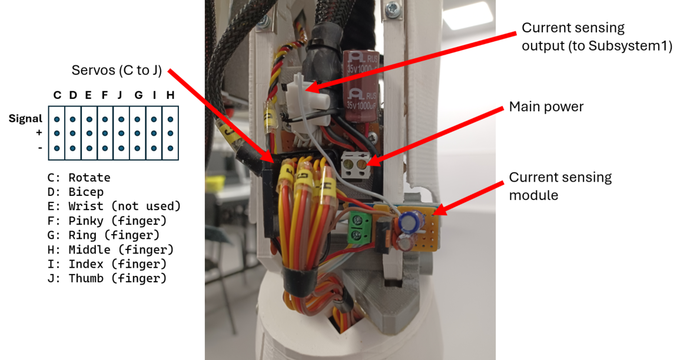
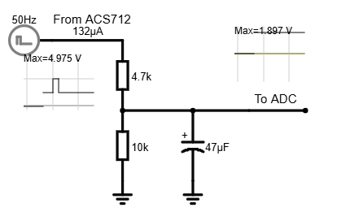
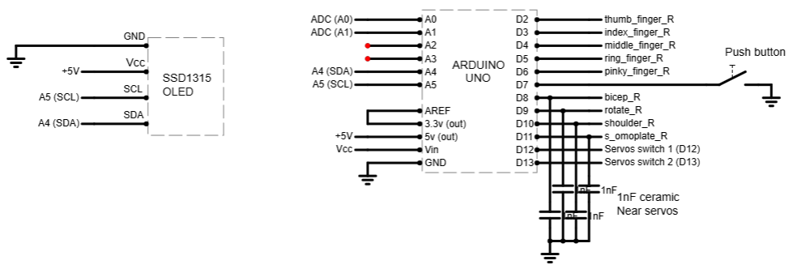
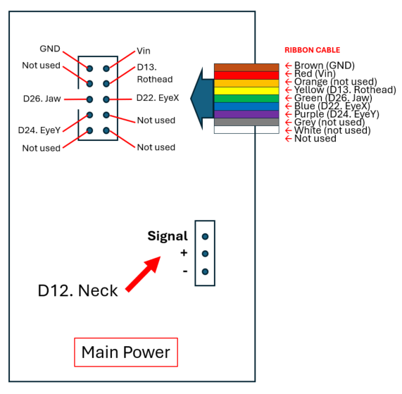

# Control subsystems

This section explains the hardware and software details of the subsystems.

## Hardware

Control subsystems form the distributed electronics layer responsible for driving and supervising the robot's actuators. Each subsystem integrates a control unit, the associated interface electronics, and the auxiliary components required to operate the joints under its responsibility. Although both subsystems share the same overall architecture, each has specific characteristics determined by its functionality and by the level of development achieved in this version of the project. The following sections describe the hardware of each subsystem, detailing its components, associated electronics, and design features.
  
### Subsystem 1

Subsystem 1 is responsible for controlling the right arm of the InMoov robot. It is based on an **Arduino Uno** board and a custom shield that integrates the servo connections, power distribution, analog signal conditioning, and diagnostic functions.

  
   Subsystem 1 overview

The subsystem controls the main joints of the right arm, including the shoulder, arm rotation, bicep/elbow, wrist, and hand. The hardware architecture separates, whenever possible, the control signals from the servo power lines, since the latter can generate high current peaks, voltage drops, and electrical noise during movement or stall conditions.
  
#### Servo Power Switching

The shield allows the power supply of different servo groups to be enabled or disabled using MOSFETs. Power switching is performed on the servo supply rail, while PWM signal generation remains independent.

The following groups are defined:

- **Group 1:** finger servos, rotate servo, and bicep servo.
- **Group 2:** shoulder and omoplate servos.

This grouping allows the power supply of high-current joints to be disconnected selectively or an entire group of servos to be disabled under fault or safety conditions. PWM outputs may remain inactive regardless of the power state.

Power switching is implemented using high-side P-channel MOSFETs, allowing the servo ground to remain common with the system ground. The MOSFET gate is held inactive through a pull-up resistor and driven from the microcontroller via an auxiliary transistor stage.

- **Group 1** is controlled from digital output D12.
- **Group 2** is controlled from digital output D13.

  
   Servo power switching groups: Group 1 (left) and Group 2 (right)

 

#### Bicep Angular Feedback

The bicep servo provides access to the wiper signal of its internal feedback potentiometer. This signal is used to estimate the initial joint position and to display the approximate joint angle during testing.

  
   Bicep servo pot

The connection between the servo and the shield uses a shielded cable:

- **Center conductor:** potentiometer wiper signal.
- **Shield:** connected to the power ground on the shield side only. The opposite end is left unconnected.

The cable shielding minimizes electromagnetic interference originating from the motor itself, the power wiring, and current pulses generated by neighboring servos.

The shield includes an RC low-pass filter to reduce high-frequency noise and stabilize the analog measurement. The series resistor limits the input current while, together with the capacitor connected to ground, forms a time constant that smooths rapid fluctuations without significantly affecting actual position changes. The filtered signal is connected to analog input A0, using a 3.3 V analog reference.

  
   Bicep servo position signal filter

The angular feedback is currently used to:

- determine the initial joint position before enabling the PWM outputs;
- display the measured joint angle;
- assist during calibration and diagnostic procedures.

It is not currently used as an automatic safety criterion because noticeable fluctuations are observed while the servo is holding torque and producing its characteristic buzzing noise.
  

#### Bicep Current Measurement

The current consumption of the bicep servo is measured using an **ACS712 Hall-effect current sensor**, physically mounted near the elbow joint and powered from a 5 V LM7805 voltage regulator, which is supplied from the same power source as the servo itself. This arrangement minimizes the length of the high-current wiring between the servo and the sensor, ensuring that only the current drawn by the bicep joint is measured.

  
   Right arm elbow

The ACS712 provides an analog output proportional to the measured current. However, this signal contains significant ripple and fast fluctuations caused by the internal PWM control of the servomotor. After extensive testing, a signal conditioning stage was implemented consisting of:

- a **resistive voltage divider** to reduce the output voltage to the ADC input range;
- an **RC low-pass filter** to extract the average current value while removing high-frequency fluctuations.

  
   Current filter

The conditioned signal is connected to analog input A1 of Subsystem 1.

The voltage divider limits the maximum output voltage because the subsystem uses a 3.3 V analog reference. This protects the Arduino ADC input while maintaining compatibility with a future migration to an ESP32-based controller.

The conversion between ADC counts and current is obtained through a calibration process that considers the complete measurement chain:

- ACS712 Hall-effect sensor;
- resistive voltage divider;
- RC low-pass filter;
- 3.3 V analog reference.

The bicep protection mechanism is triggered whenever the measured current exceeds approximately 1100 mA for at least 150 ms. This criterion has proven effective in detecting:

- joint end-stop collisions;
- external obstacles;
- mechanical overloads;
- servo stall conditions.

Once an overcurrent condition is confirmed, the firmware enters a fault state and immediately disables the PWM output driving the servo.
  

#### Diagnostic Display

The shield incorporates a 128 × 64 pixel SSD1306 OLED display connected through the I²C bus.

The Arduino Uno uses the following pins:

- **A4:** SDA
- **A5:** SCL

The configured I²C address is typically **0x3C**.

The display provides local diagnostic information, including the commanded position of each servo together with the measured position and current consumption of the bicep servo. To reduce RAM usage on the Arduino Uno, the display is refreshed only on request or when a fault condition occurs.

  
   Arduino and OLED

 

#### Push Button

A push button has been implemented with one terminal connected to ground and the other connected to digital input D7, configured with the Arduino's internal pull-up resistor.

During development, the button was used to trigger various debugging and testing functions. In the current version of the project, it is used to switch between the different information screens displayed on the OLED.
  

#### Power Supply and Decoupling

The servomotors are powered by an external 6 V / 5 A power supply. Servo power is not obtained from the Arduino voltage regulator.

To reduce disturbances caused by rapid current transients and PWM crosstalk between neighboring servo signal lines, 1 nF ceramic decoupling capacitors are installed close to the power input of the highest-current servos.

The servo power wiring uses conductors with an adequate cross-sectional area to minimize voltage drops under load.
  

#### Falstad Schematic

The complete electronic schematic of the subsystem is available in the project repository:

https://github.com/aalonsopuig/Inmoov_ROS2/tree/main/hardware/schematics

 

---
 

### Subsystem 2

Subsystem 2 is responsible for controlling the robot's left arm, head, and neck. Its control unit is based on an **Arduino Mega**, selected for its larger number of digital and analog I/O pins, which are required to manage the higher number of servomotors in this part of the robot.

In the current version of the project, the associated hardware is considerably simpler than that of Subsystem 1. The electronics consist solely of a custom connection shield, whose purpose is to distribute power and provide an organized interface for connecting the servomotors and the remaining subsystem components.

Unlike the shield used in Subsystem 1, this board does not include additional circuitry for signal conditioning, current monitoring, diagnostic functions, or protection mechanisms. Its role is limited to providing a reliable electrical interface between the control board and the actuators.

> **Note:** The use of ribbon cable is not recommended because it can introduce crosstalk between adjacent signal lines. To reduce false activations, it is recommended to install 1 nF ceramic capacitors between the **RotHead** signal and ground, and between the **Neck** signal and ground. Large Hitec servos have been observed to occasionally move unexpectedly toward their end positions due to noise coupled from neighboring signal lines.

The shield is expected to evolve in the next version of the project, incorporating advanced features similar to those already implemented in the Subsystem 1 shield.

  
   Subsystem 2 overview

  

## Software

Servo control is a fundamental aspect of any humanoid robot, especially when using 3D-printed mechanisms and high-torque servos to move large and delicate parts, as is the case with InMoov. Sudden or overly fast movements can cause mechanical overload, current spikes, and even break plastic components, so it is essential that all movements are smooth and well-controlled.

The standard Arduino `Servo.h` library is the most common option for controlling servomotors via PWM, allowing multiple servos to be connected to boards like Arduino Uno and Mega. However, this library does not provide any built-in mechanism for velocity control or for generating acceleration/deceleration ramps—it simply moves the servo immediately to the specified angle.

There are third-party Arduino libraries for more sophisticated velocity control, such as [VarSpeedServo by Jeff Korman](https://github.com/netlabtoolkit/VarSpeedServo), which adds a speed parameter to each servo movement. However, this library is limited to eight simultaneous servos, which is insufficient for InMoov (up to nine servos on the right arm, up to fourteen on the Mega board). Other advanced alternatives, like VarSpeedServoRA4M1 by Kaled Souky, are designed for more powerful microcontrollers than Arduino Uno R3 or Mega, and therefore are not suitable for this hardware.

Given these limitations, a custom velocity control system was developed, fully compatible with the project’s architecture and scalable to the required number of servos.

The software compares the current servo position to the target position and performs small increments or decrements at fixed intervals, interpolating the movement in small steps. This method—known as linear interpolation—ensures smooth, constant-speed motion without acceleration or deceleration ramps.

Although it may seem that this method does not implement an acceleration or deceleration ramp as such, the servo itself implements these ramps through its internal control algorithms. In advanced robotics, trapezoidal or S-curve velocity profiles are used, in which the motion starts slowly, progressively accelerates until reaching a cruising speed, and finally decelerates again before reaching the target position.
  

### Implementation

Each Arduino subsystem has a specific program:

- [Xicro_subsys1_ID_1.ino](../Arduino/Xicro_subsys1_ID_1/Xicro_subsys1_ID_1.ino) for Subsystem 1 (Arduino Uno)
- [Xicro_subsys1_ID_2.ino](../Arduino/Xicro_subsys2_ID_2/Xicro_subsys2_ID_2.ino) for Subsystem 2 (Arduino Mega)

The subsystems use the XICRO interface to receive commands from the central computer, allowing each joint to be assigned an individual target angle. Each servo is parameterized with its own safe movement range, a rest position, and a velocity (defined by step size and update interval). Servo movements are interpolated—gradually advancing or retracting until the target is reached—ensuring smooth operation and protecting the mechanics.

If a command with value zero is received, the program interprets this as a request to move the joint to its rest position, without the central system needing to know this value in advance. Received angles are always limited to the safe range configured for each servo before being sent to the motor. The control system is robust against out-of-range values and can be adapted to any servo in the assembly, including both large and small joints. It is flexible and allows easy adjustment of both the global movement speed and the individual parameters of each joint.
  

### Subsystem 1: Right Arm (Arduino Uno)

In version 1.1 of the project, proprioceptive sensors have been incorporated into the robot’s right bicep, specifically a position feedback potentiometer, the one integrated into the servo itself, and a current sensor. These sensors make it possible to estimate the internal state of the joint and detect abnormal mechanical load conditions.

The static configuration of the servomotors is centralized in [servo_config_inmoov.h](../Arduino/Xicro_subsys1_ID_1/servo_config_inmoov.h), where the PWM pins, angular ranges, rest positions, mechanical limits, speeds, feedback parameters and protection thresholds are defined.

| Servo | ROS 2 / XICRO topic | Arduino pin | Default speed | Rest angle | Minimum allowed angle | Maximum allowed angle |
|---|---|---:|---:|---:|---:|---:|
| THUMB_R | `/thumb_finger_R` | D2 | 50% | 180° | 106° | 180° |
| INDEX_R | `/index_finger_R` | D3 | 50% | 150° | 80° | 160° |
| MIDDLE_R | `/middle_finger_R` | D4 | 50% | 150° | 65° | 166° |
| RING_R | `/ring_finger_R` | D5 | 50% | 160° | 70° | 162° |
| PINKY_R | `/pinky_finger_R` | D6 | 50% | 155° | 95° | 168° |
| BICEP_R | `/bicep_R` | D8 | 40% | 22° | 16° | 85° |
| ROTATE_R | `/rotate_R` | D9 | 50% | 105° | 60° | 145° |
| SHOULDER_R | `/shoulder_R` | D10 | 10% | 70° | 45° | 150° |
| OMOPLATE_R | `/omoplate_R` | D11 | 10% | 2° | 2° | 38° |

The main program is responsible for safely initializing the power supply to the servo groups, reading the initial position of the right bicep through its feedback sensor, assigning each servo either to its rest position or to its measured position, and subsequently receiving position commands from ROS 2. During execution, the firmware constrains commanded positions to the defined safe ranges, generates smooth movements through progressive increments, and monitors the current consumption of the right bicep in order to stop it automatically under a mechanical overload condition. In addition, it incorporates an OLED screen for basic diagnostics, updated only on demand or in the event of a fault, in order to reduce memory usage on the Arduino Uno.

IMPORTANT NOTE: It should be mentioned that Subsystem 1, based on an Arduino Uno, is operating close to its memory limits, so adding further functionality does not appear to be feasible. The natural next step would be to migrate to a system with greater memory availability.
  

### Subsystem 2: Left Arm & Head (Arduino Mega)

Subsystem 2 keeps the code from version 1.0 of the project, in which the angles are calculated differently from version 1.1. As part of version 1.2 of the project, this code is expected to be updated. For the time being, however, it has been kept unchanged because the left arm is not yet functional, so only the head and neck components are actually moved.

In this version, the servo configurations are included directly in the main program file and have not been moved to a separate `.h` file.

| Topic              | Servo Instance       | Arduino Pin | Speed | Rest Angle (º) | Min (º) | Max (º) |
|--------------------|---------------------|-------------|-------|----------------|---------|---------|
| thumb_finger_L     | s_thumb_finger_L    | 2           | 2     | 144            | 112     | 177     |
| index_finger_L     | s_index_finger_L    | 3           | 2     | 135            | 85      | 150     |
| middle_finger_L    | s_middle_finger_L   | 4           | 2     | 135            | 70      | 140     |
| ring_finger_L      | s_ring_finger_L     | 5           | 2     | 135            | 80      | 160     |
| pinky_finger_L     | s_pinky_finger_L    | 6           | 2     | 135            | 90      | 165     |
| bicep_L            | s_bicep_L           | 8           | 1     | 50             | 50      | 110     |
| rotate_L           | s_rotate_L          | 9           | 1     | 90             | 80      | 135     |
| shoulder_L         | s_shoulder_L        | 10          | 1     | 90             | 90      | 120     |
| omoplate_L         | s_omoplate_L        | 11          | 1     | 5              | 0       | 20      |
| neck               | s_neck              | 12          | 2     | 110            | 25      | 170     |
| rothead            | s_rothead           | 13          | 1     | 90             | 50      | 130     |
| jaw                | s_jaw               | 26          | 10    | 9              | 9       | 20      |
| eye_x (tilt)       | s_eye_x             | 22          | 2     | 80             | 70      | 107     |
| eye_y (pan)        | s_eye_y             | 24          | 2     | 80             | 60      | 100     |

**Note:** `eye_y` is pan and `eye_x` is tilt.

---

[Return to README.md](../README.md)
