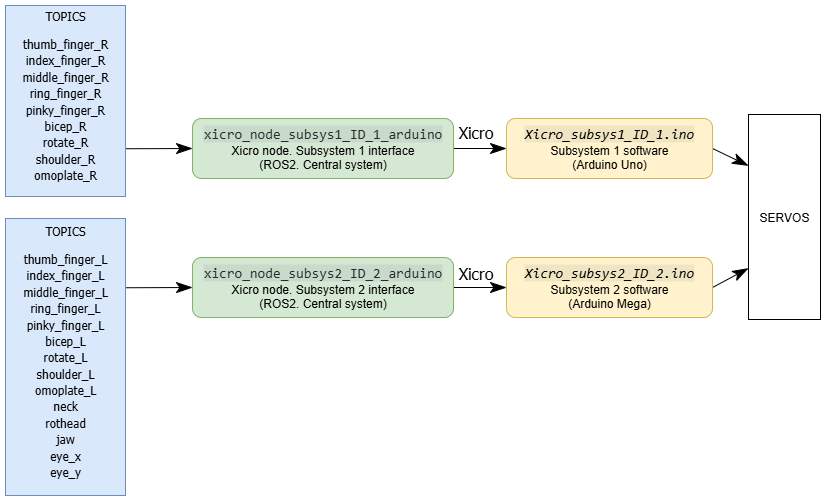
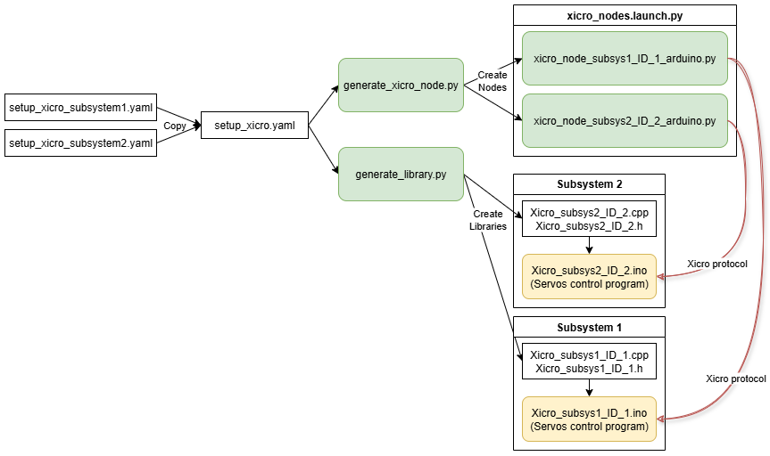
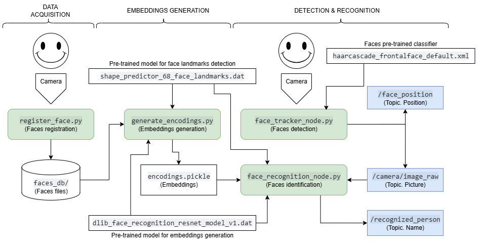
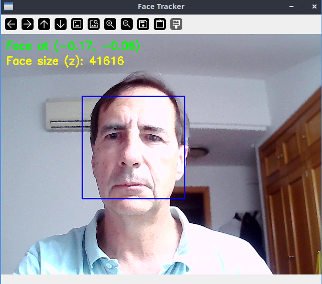
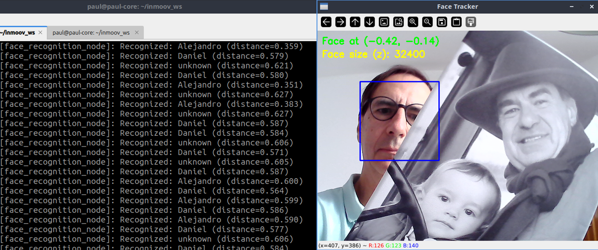
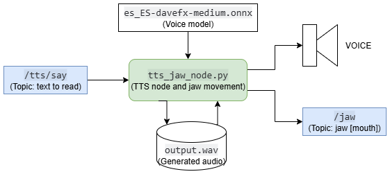
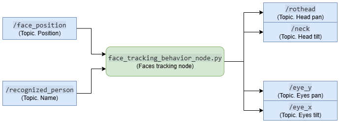
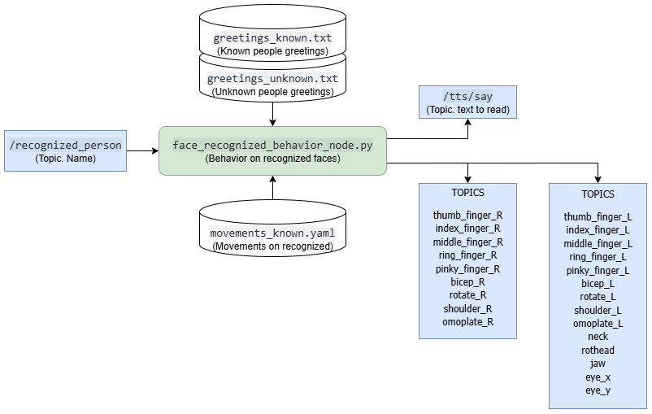

 
 

This section describes the main ROS 2 packages and nodes developed for the InMoov ROS2 project. Each package is designed to encapsulate a core functional area of the system, ensuring modularity, clarity, and ease of maintenance.

# Communications: xicro_nodes

### Problem to solve
The InMoov robot of this project uses two Arduino boards: an Arduino Uno that controls the right arm, and an Arduino Mega that manages the left arm, neck and head. The goal is to integrate both with a central computer running ROS 2 so the system can send high-level commands (for example, move a finger by x degrees or rotate the head by x degrees), while the Arduinos execute low-level tasks such as servo control. The difficulty arises because standard integration solutions between microcontrollers and ROS 2 require hardware capabilities beyond those of the boards in use, and we do not want to modify the original InMoov hardware; keeping the original hardware ensures the solution remains suitable for the community of developers who already use these boards.

### Available options
The first option considered was rosserial, a classic solution for ROS 1, but it is currently incompatible with ROS 2. Therefore it is not suitable for this project. Secondly, micro-ROS was evaluated; it requires 32-bit microcontrollers with more memory and processing power than an Arduino Uno or Mega, so it was also discarded. Another alternative was ros2arduino, based on XRCE-DDS and designed for boards such as ESP32 or MKR Zero, but likewise not compatible with 8-bit boards. Implementing a custom serial protocol between the Arduinos and the central computer was a technically viable option, but it would demand greater development and maintenance effort. Finally, XICRO-ROS2 was identified as a solution specifically aimed at constrained microcontrollers, compatible with 8-bit boards like the Arduino Uno and Mega, and offering native ROS 2 support over UART.

### Solution used  
The chosen solution is XICRO-ROS2, a tool that generates both the firmware that runs on the Arduinos and the ROS 2 node that integrates on the host computer. Via a configuration file, the topics to publish and subscribe, the connected sensors and actuators, and the serial port speed might be defined. The system produces a library that is compiled as Arduino firmware and a Python node that runs on the central computer.

In this architecture each Arduino receives commands from the computer via the USB port (used as a UART interface) and performs tasks such as moving servos. Conversely, the Arduinos may send information back to the computer about sensor states or other relevant variables. The intermediate Python node is responsible for translating between the microcontroller’s internal data format and native ROS 2 messages.

In this project a [fork](https://github.com/aalonsopuig/Xicro-enhanced) of the original Xicro repository is used, because the official version was not compatible with launching nodes via ROS 2 launch; the fork incorporates the necessary modifications to allow execution from launch files and is the version employed in the development.

  

### Configuration and Usage  
The integration process between ROS 2 and the Arduino microcontrollers of the InMoov robot was carried out using the XICRO-ROS2 tool, which automates both the generation of the firmware library for the microcontroller and the Python node responsible for communication within the ROS 2 environment. 

For this purpose, each subsystem (right arm and left arm plus head) is configured independently via a YAML file ([setup_xicro_subsystem1.yaml](../inmoov_ws/src/Xicro/xicro_pkg/config/setup_xicro_subsystem1.yaml) and [setup_xicro_subsystem2.yaml](../inmoov_ws/src/Xicro/xicro_pkg/config/setup_xicro_subsystem2.yaml)) that defines the microcontroller identifier, topic names, serial connection parameters and the characteristics of the messages to be sent or received.

Because the generation script does not accept multiple configuration files simultaneously, the procedure consists of copying the YAML file corresponding to each subsystem to the generic name `setup_xicro.yaml` inside the `xicro_pkg` package configuration folder. The generators are then executed to produce the firmware library and the Python node for each case. 

All these steps are described in detail on the **Installation** section.

  

In summary:

- Nodes are auto-generated using XICRO from YAML configuration files that define each servo, its pin assignment, movement limits, and initial values.
- Typical node names:  
  - `xicro_node_subsys1_ID_1_arduino.py` (right arm, Arduino Uno)  
  - `xicro_node_subsys2_ID_2_arduino.py` (left arm and head, Arduino Mega)
- These nodes subscribe to topics such as `/shoulder_R`, `/neck`, etc., receiving target angles and forwarding commands to the microcontrollers.
- They can be launched individually or together using a ROS 2 launch file.

**Auxiliary Scripts and Tools:**
- **`xicro_servo_test_gui.py`:**  
  A graphical Python tool for manually testing and calibrating all servos in both subsystems.  
  *Location:* `~/inmoov_ws/tools/xicro_servo_test_gui.py`

---
 

# Vision: inmoov_vision

### Objectives

The computer vision system aims to provide the InMoov robot with basic perceptual capabilities, enabling it to interact with its environment in an autonomous and contextualized manner. Within the scope of this project, two main functional objectives have been defined:

**1. Generic Human Face Detection**

The system must be able to identify the presence of one or more human faces within the field of view of the camera connected to the central computer. Once detected, the relative position of the dominant face — typically the largest one — is computed in order to automatically orient the robot's head (pan and tilt movements), enabling a simple yet effective visual tracking mechanism.

**2. Specific Recognition of Known Individuals**

A facial recognition module will be integrated to identify individuals who have been previously registered in a local face database. This functionality allows the robot to generate personalized responses, such as greeting recognized individuals by name, thereby enhancing its social interaction capabilities.

Both modules are implemented as independent ROS 2 nodes, developed in Python, and communicate via specific topic publication and subscription. All processing is performed locally, without requiring an Internet connection, and uses lightweight computer vision tools compatible with the available hardware. This modular and reproducible architecture — designed to operate without GPU acceleration — follows an educational and maker-oriented approach, promoting accessibility, transparency, and reusability in training and prototyping environments.

### Technical Basis

The facial recognition system is composed of three main stages, each implemented through a dedicated script or ROS 2 node and based on robust computer vision and deep learning techniques:

#### Image Capture and Registration

In the first phase, the `register_face.py` script is used for acquiring and organizing training images. This script allows capturing multiple photographs of each person through the robot’s camera, storing them in the local `faces_db/` database, organized into subfolders (one per individual). The technical objective is to collect a representative set of faces for each person, covering slight variations in expression, lighting, and position, which facilitates the generation of robust descriptors in the following phases.

#### Facial Embedding Generation

The second phase focuses on extracting facial descriptors (embeddings) from the stored images. This is carried out with the `generate_encodings.py` script, which scans the `faces_db/`, detects faces in each image, and applies the pretrained `shape_predictor_68_face_landmarks.dat` model to locate 68 key points (landmarks) on each face. Subsequently, the `dlib_face_recognition_resnet_model_v1.dat` model transforms the aligned facial region into a 128-dimensional numerical vector that uniquely encodes facial morphology. All generated embeddings are stored, along with the corresponding person’s label, in the serialized file `encodings.pickle`. This file serves as the reference database for identification.

#### Real-Time Recognition

The final stage is implemented by the ROS 2 node `face_recognition_node.py`. This node runs within the robot’s operating environment and subscribes to the `/camera/image_raw` topic, which provides real-time video frames published by another node (typically `face_tracker_node.py`). For each received frame, the node detects faces, localizes landmarks, and extracts embeddings. The resulting vector is compared against those stored in `encodings.pickle` using Euclidean distance. If the embedding is sufficiently close (below a configurable threshold) to one of the registered entries, the system publishes the identified name to the `/recognized_person` topic. Otherwise, it publishes the generic identifier `unknown`. This stage enables the robot to respond in a personalized manner to the presence of known individuals, integrating computer vision within a modular ROS 2 message-based architecture.

All these steps are described in detail on the **Installation** and **Usage** sections.

  

#### Technical Considerations

This approach combines traditional face detection techniques (deep learning-based for landmarks and embeddings) with a modular pipeline that clearly separates the training phase (offline) from the inference phase (online). The robustness of the system largely depends on the quality and variability of the registered images, as well as the frontal orientation of the face during inference, since landmark detection and alignment may be affected by extreme rotations or occlusions. The use of vector embeddings facilitates scalability and efficient comparison, and represents a standard practice in the community for facial verification and identification tasks.

### Nodes and Topics

The computer vision system is structured into several functional components, organized as ROS 2 scripts and nodes that interact via topic-based communication. 

The main components and their roles are described below:

**New faces registration**: [register_face.py](../inmoov_ws/src/inmoov_vision/inmoov_vision/register_face.py)

An interactive script used to capture training images of different individuals. The images are stored in separate subfolders within the `faces_db/` directory — one for each identity.

**Encodings generation**: [generate_encodings.py](../inmoov_ws/src/inmoov_vision/inmoov_vision/generate_encodings.py)

A preprocessing script that scans the `faces_db/`, detects faces in each image, and computes their feature vectors (embeddings). These vectors are serialized and saved in the file `encodings.pickle`, which is later used by the recognition system.

To implement this, two pretrained Dlib model files are required:

- `shape_predictor_68_face_landmarks.dat`: used to obtain the 68 facial landmarks.  
- `dlib_face_recognition_resnet_model_v1.dat`: used to compute the facial feature vectors (embeddings).  

**Faces detection**: [face_tracker_node.py](../inmoov_ws/src/inmoov_vision/inmoov_vision/face_tracker_node.py)

Uses OpenCV Haar cascade classifiers for real-time face detection from the robot's USB camera. It publishes the relative position of the most prominent face (normalized in the range [-1, 1]) to the topic `/face_position` as a `geometry_msgs/Point` message. It also republishes the raw video frames on the `/camera/image_raw` topic (`sensor_msgs/Image`) for use by other system nodes.

  

**Faces recognition** [face_recognition_node.py](../inmoov_ws/src/inmoov_vision/inmoov_vision/face_recognition_node.py)

A ROS 2 node based on Dlib that subscribes to the video stream published by `face_tracker_node.py`, detects and encodes faces in real time, and compares their embeddings against those stored in `encodings.pickle` using the Euclidean distance. If a match is found with sufficient confidence, the recognized person's name is published to the `/recognized_person` topic as a `std_msgs/String` message.

  

---
 

# Speach synthesys: inmoov_voice

### Approach

Text-to-Speech (TTS) is the technology that converts written text into artificial speech. In social and educational robotics, such as the InMoov project, TTS enables the robot to verbally communicate with users, making interaction more natural, accessible, and understandable. This capability is essential for the robot to act as an autonomous agent, able to convey information, give instructions, or maintain dialogue, thus facilitating both scientific outreach and learning in educational environments.

During the development of the voice synthesis system for the InMoov robot, several offline TTS solutions were evaluated, including eSpeak NG, Coqui TTS, pyttsx3, and neural synthesis systems such as Piper. The main criteria for the final choice were compatibility with Python 3.12, the quality and naturalness of male Spanish voices, fully local operation (without Internet connection), and ease of integration with ROS 2. After practical testing, [Piper](https://github.com/OHF-Voice/piper1-gpl) proved to be the most robust option, as it provides high-quality synthesis, efficient execution, and pre-trained Spanish models. The system is implemented as a ROS 2 node, allowing simple integration with the rest of the robotic architecture.

The `tts_jaw_node` receives sentences to synthesize by subscribing to the `/tts/say` topic of type `std_msgs/String`. Each time a text message is received, the node generates the corresponding audio signal using Piper. To achieve realistic jaw movement during voice playback, the node analyzes the generated WAV audio signal, calculating energy (RMS amplitude) in time windows of approximately 50 ms. Based on the detected energy, the node publishes the jaw servo position on the `/jaw` topic (`std_msgs/Int16`), so that the mouth opens wider in segments of higher energy and closes during silences. This method provides a natural visual effect without requiring phoneme-viseme mapping, representing a significant improvement over simple binary movement.

  

Pretrained Piper models are stored locally in the `/piper` directory. The model used in this project is `es_ES-davefx-medium`. It is for a male spanish voice, but you could get other voices from [Piper Voice Samples](https://rhasspy.github.io/piper-samples/) 

### Nodes and Topics

The project implements two different nodes for speech synthesis:

**TTS only**: [tts_node.py](../inmoov_ws/src/inmoov_voice/inmoov_voice/tts_node.py)  
A simple Text-to-Speech node that subscribes to the `/tts/say` topic (`std_msgs/String`).  
Upon receiving text, it generates audio using Piper and plays it through the system’s speakers.  
This node serves as a minimal and clean example of TTS integration in ROS 2, useful for reuse in other applications.

**TTS and mouth (jaw) movement**: [tts_jaw_node.py](../inmoov_ws/src/inmoov_voice/inmoov_voice/tts_jaw_node.py)  
An extended version of the TTS node. It also subscribes to `/tts/say` and synthesizes audio using Piper, but in addition, it analyzes the generated audio signal to compute energy levels and publishes corresponding commands to the `/jaw` topic (`std_msgs/Int16`).  
This allows the robot’s mouth to move in sync with the speech, creating a more natural effect for human-robot interaction.

In practice, the `tts_jaw_node` is the one used in the InMoov robot, while `tts_node` is kept as a simplified reference implementation.

---
 

# Behaviors: inmoov_behaviors

### Approach
In cognitive and service robotics it is common to distinguish three major behavior paradigms: reactive, which responds directly to sensory stimuli without explicit planning; deliberative, which builds an internal model of the world and plans long-term sequences of actions; and hybrid, which combines both approaches to achieve efficiency and robustness.  

Within the scope of this project, reactive behaviors have been selected due to their simplicity of implementation and their ability to react in real time to face detection and identity recognition, which is critical in dynamic environments with human users.  

For this purpose, two separate ROS 2 nodes have been developed: one in charge of dynamic face tracking, and another dedicated to handling greetings and specific movements when the identity of a person is recognized. Both nodes work in coordination to enhance the robot’s ability to perceive and respond to real users, fostering communication and the perception of autonomy.  

In the future, however, the architecture could be extended to incorporate deliberative modules, allowing for example the storage of interaction histories, the planning of complex dialogues, or the coordination of behaviors in longer tasks.  

### Nodes and Topics

The project implements two different nodes:

**Face Tracking Node**: [face_tracking_behavior_node.py](../inmoov_ws/src/inmoov_behaviors/inmoov_behaviors/face_tracking_behavior_node.py)  
This ROS 2 Python node (`face_tracking_behavior_node`) ensures that the camera mounted on the InMoov’s head follows any detected person and adds a subtle eye movement for greater naturalness. It subscribes to `/face_position` (`geometry_msgs/Point`), which provides the horizontal and vertical deviation of the face relative to the image center, and to `/recognized_person` (`std_msgs/String`) to ensure that the tracked target is a valid person. Based on this information, the node incrementally adjusts the head servo angles (`/rothead` for pan and `/neck` for tilt), inverting the deviation sign to move in the correct direction, and directly maps the deviation to eye positions (`/eye_y` for horizontal gaze and `/eye_x` for vertical gaze).  
To avoid erratic movements or “staring into the void” when the face disappears or is not recognized as a person, the node maintains a counter of null or invalid messages. If this counter exceeds a threshold, both the head and eyes automatically return to their central resting positions. All commands are constrained within the allowed mechanical ranges to ensure servo safety and integrity.  

  

**Person Recognition Behavior Node**: [face_recognized_behavior_node.py](../inmoov_ws/src/inmoov_behaviors/inmoov_behaviors/face_recognized_behavior_node.py)   
The node `face_recognized_behavior_node.py` subscribes to the `/recognized_person` topic to continuously receive the name of the detected person (or the special strings `"none"` and `"unknown"`). Based on this value, it decides whether to trigger a behavior.  

- **Unknown persons**: when the received message is `"unknown"`, the node randomly selects a greeting phrase from the lines loaded from [greetings_unknown.txt](../inmoov_ws/src/inmoov_behaviors/inmoov_behaviors/greetings_unknown.txt) and publishes it to `/tts/say` (`std_msgs/String`). A minimum interval of ten seconds between greetings is always enforced to avoid repetition.  
- **Known persons**: when the received name matches a registered user, the node picks an entry from [greetings_known.txt](../inmoov_ws/src/inmoov_behaviors/inmoov_behaviors/greetings_known.txt), replaces the `<nombre>` tag with the actual value, and publishes the personalized message to `/tts/say`. Immediately after, it triggers the execution of a gesture sequence defined in [movements_known.yaml](../inmoov_ws/src/inmoov_behaviors/inmoov_behaviors/movements_known.yaml), where each step specifies angular values for different joints of the robot (publishing to topics such as `/thumb_finger_R`, `/bicep_R`, `/neck`, `/eye_y`, etc.) and an associated delay before moving to the next step. The topics and angles are fully configurable in the YAML file, and the node dynamically creates publishers according to the specified movements. ROS 2 timers ensure that the sequence is executed without blocking the processing of other messages or callbacks.  
- **None**: if the message is `"none"`, the node remains idle until the content of `/recognized_person` changes and the ten-second interval has elapsed.  

Throughout the process, an internal timer prevents excessive behavior triggering, and potential errors when reading greeting or movement files are logged via the ROS 2 logger.  

**Location:**  
`~/inmoov_ws/src/inmoov_behaviors/inmoov_behaviors/`

  

### Configuration
 
- Behavior sequences and greeting phrases are defined in YAML and TXT files within the package, allowing easy updates without code changes.
- The package is designed for extensibility, enabling the addition of new behaviors by editing configuration files.

For more details on the execution of behabior nodes refer to the **Installation** and **Usage** sections.

---

Each package and node is thoroughly documented in the source code, and designed to be self-contained for ease of reuse in other robotics projects.
